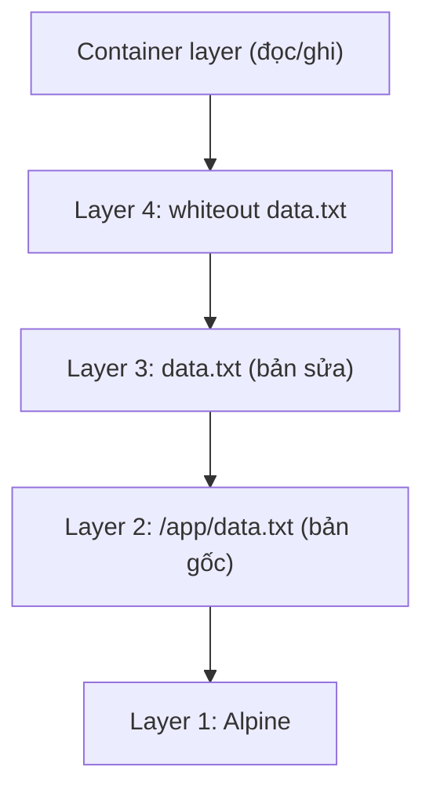

## Giới thiệu

Khi làm việc với Docker, ta thường xuyên phải tải các Docker image. Bài này tìm hiểu Docker image là gì, nó được lưu trữ dưới dạng các layer như thế nào, và container đọc/ghi file trên các layer đó ra sao.

### Cách Docker lưu trữ Image

- Docker image thực chất là các layer xếp chồng lên nhau, cộng với 1 file cấu hình JSON (chứa `CMD`, `ENV`, `WORKDIR`... và danh sách các layer). Mỗi layer là 1 bản chụp các file bị thêm/sửa/xóa sau một lệnh trong Dockerfile (`RUN`, `COPY`, `ADD`). Các lệnh còn lại chỉ sửa file cấu hình, không tạo layer.

```dockerfile
# (1) Base image
FROM alpine:latest

# (2) THÊM file mới
RUN mkdir -p /app && echo "Phiên bản gốc" > /app/data.txt

# (3) SỬA file 
RUN echo "Phiên bản đã sửa" > /app/data.txt

# (4) XÓA file
RUN rm /app/data.txt

# (5) Cấu hình Metadata
CMD ["sh"]
```

- Bước 1: Docker tải layer của image Alpine về và lưu trên ổ cứng làm Layer 1. (Alpine chỉ có 1 layer; các base image khác như `ubuntu` hay `node` có thể gồm nhiều layer.)
- Bước 2: RUN mkdir -p /app && echo "Phiên bản gốc" > /app/data.txt
    - Hành động (THÊM): tạo thư mục /app và ghi file data.txt vào đó
    - Dưới ổ cứng, Docker tạo 1 layer vật lý mới, layer này chỉ lưu đúng 1 thứ: thư mục /app và file /app/data.txt với nội dung là "Phiên bản gốc". Nó không sao chép lại toàn bộ các file ở bước 1, dung lượng chỉ tăng xấp xỉ kích thước file data.txt.
- Bước 3: RUN echo "Phiên bản đã sửa" > /app/data.txt
    - Hành động (SỬA): ghi đè nội dung vào file đã có
    - Cơ chế copy-on-write: vì Layer 2 đã khóa (chỉ đọc), docker sẽ kéo (copy) file từ layer 2 lên layer 3, sau đó sửa nội dung thành "Phiên bản đã sửa" và lưu lại ở layer 3. Dưới ổ cứng, layer 3 lưu duy nhất file /app/data.txt — và lưu **toàn bộ file**, không phải chỉ phần khác biệt. Sửa 1 byte trong file 100MB thì layer mới vẫn nặng 100MB.
- Bước 4: RUN rm /app/data.txt
    - Hành động (DELETE): Lệnh yêu cầu xóa file.
    - Cơ chế Whiteout: Docker không quay lại Layer 2 hay 3 để xóa file (vì chúng đã read-only). Thay vào đó, ở Layer 4, Docker tạo ra một file "xóa bóng" (whiteout). Trong file tar của image (định dạng OCI), whiteout là file ẩn `/app/.wh.data.txt`; khi giải nén ra OverlayFS trên máy host, nó được chuyển thành một character device `0/0` mang đúng tên `data.txt`.
    - Dưới ổ cứng (Layer 4): Chỉ lưu file whiteout này. File gốc ở Layer 2 và Layer 3 vẫn nằm nguyên trên ổ cứng và vẫn tính vào tổng dung lượng của Image. Đây là lý do `RUN rm` ở một lệnh riêng **không làm image nhỏ đi**.
- Bước 5: CMD ["sh"]
    - Hành động (METADATA): Cập nhật file cấu hình JSON.
    - Dưới ổ cứng: Không tạo layer nào (0 byte, `docker history` hiển thị dòng này với SIZE là 0B). Chỉ file cấu hình JSON của image thay đổi, nên Image ID (là hash của file cấu hình) cũng đổi theo.

### Cách Docker hợp nhất các layer khi chạy container
Khi chạy container, Docker dùng union filesystem (trên Linux hiện nay là OverlayFS: qua storage driver `overlay2`, hoặc qua snapshotter `overlayfs` của containerd, mặc định từ Docker Engine 29) để xếp chồng các layer này lại thành 1 hệ thống file duy nhất. Docker cũng thêm một layer đọc/ghi rỗng của container lên trên cùng. Container nhìn xuyên qua các layer từ cao xuống thấp.

Mô hình mặt cắt ngang khi container tìm `/app/data.txt`:

| Lớp (Layer) | Chứa gì trên đĩa cứng? | Góc nhìn của Container khi quét qua |
| --- | --- | --- |
| Container layer (trên cùng, đọc/ghi) | Rỗng lúc mới khởi động | Không thấy gì, quét xuống tiếp. |
| Layer 4 (chỉ đọc) | Whiteout của `/app/data.txt` | 🛑 "Có whiteout, nghĩa là `data.txt` đã bị xóa. Báo cho người dùng là không có file này!" |
| Layer 3 (chỉ đọc) | `/app/data.txt` (bản sửa) | 🙈 Bị che khuất bởi whiteout ở Layer 4. Container không đọc tới đây. |
| Layer 2 (chỉ đọc) | Thư mục `/app` + `/app/data.txt` (bản gốc) | 🙈 File bị che khuất. Thư mục `/app` vẫn hiển thị (rỗng). |
| Layer 1 (dưới cùng, chỉ đọc) | HĐH Alpine (`/bin`, `/etc`...) | ✅ Container nhìn thấy các file hệ thống và sử dụng bình thường. |

- Hệ thống file mà container thấy là một hệ thống file ảo: Linux chỉ mount các thư mục rời rạc của từng layer chồng lên nhau để tạo ra 1 góc nhìn duy nhất, không copy file nào cả.
- Một mount OverlayFS gồm 4 thư mục: `lowerdir` (các layer image, chỉ đọc), `upperdir` (layer container, đọc/ghi), `workdir` (thư mục nội bộ của OverlayFS) và `merged` (góc nhìn hợp nhất, chính là `/` của container). Trên máy host có thể xem bằng `grep overlay /proc/mounts`:

```text
overlay /var/lib/docker/rootfs/overlayfs/e53e50... overlay rw,relatime,
  lowerdir=/var/lib/containerd/io.containerd.snapshotter.v1.overlayfs/snapshots/5310/fs:
           /var/lib/containerd/io.containerd.snapshotter.v1.overlayfs/snapshots/5204/fs,
  upperdir=/var/lib/containerd/io.containerd.snapshotter.v1.overlayfs/snapshots/5311/fs,
  workdir=/var/lib/containerd/io.containerd.snapshotter.v1.overlayfs/snapshots/5311/work
```

> Với storage driver `overlay2` cũ, các layer nằm ở `/var/lib/docker/overlay2/` và có thể xem bằng `docker inspect <container> --format '{{json .GraphDriver.Data}}'`. Với containerd image store, lệnh này trả về `null`, nên dùng `/proc/mounts` như trên.
{: .prompt-info }

- Khi container đọc một file, ví dụ `cat /app/data.txt`:

    - Nhân Linux nhận yêu cầu và thấy đường dẫn này thuộc mount OverlayFS (thư mục `merged`).

    - OverlayFS tra cứu đường dẫn đó trong các thư mục vật lý rời rạc (`upperdir` rồi lần lượt các `lowerdir`). Việc tra cứu chỉ diễn ra khi có truy cập (theo từng đường dẫn, không quét toàn bộ file trước), và kết quả được nhân Linux cache lại trong RAM (dentry/inode cache), nên lần truy cập sau rất nhanh.

- Logic chắt lọc khi tra cứu một đường dẫn:

    - Tìm ở layer trên cùng (Read-Write layer của container). Nếu có file, dùng luôn bản này.
    - Nếu gặp "whiteout" (file xóa bóng), dừng lại và báo file không tồn tại.
    - Nếu chưa thấy, tìm tiếp xuống các layer bên dưới (Read-Only). Layer nào cao hơn có file thì bản đó thắng.
    - Với thư mục (ví dụ `ls /app`), OverlayFS gộp danh sách file của tất cả các layer, bỏ đi các file trùng tên ở layer thấp hơn và các file bị whiteout.

### Làm sao Docker sửa được file khi các layer Image đều đã bị khóa (Read-Only)?

- Khi chạy `docker run`, Docker tạo 1 layer rỗng ở trên cùng, có quyền đọc/ghi (container layer). Mọi thao tác **ghi** (tạo, sửa, xóa file) của container đều diễn ra trên layer này. Thao tác **đọc** thì vẫn nhìn xuyên qua tất cả các layer như phần trên.
- Giả sử bạn đang ở trong container và gõ: echo "Dữ liệu mới toanh" >> /etc/motd

- Vì /etc/motd đang nằm ở Layer 1 (bị khóa read-only), OverlayFS sẽ kích hoạt cơ chế Copy-on-Write (Sao chép khi ghi) với các bước sau:

    - Bước 1 - Định vị: OverlayFS tìm từ trên xuống và phát hiện file motd đang nằm ở Layer 1.
    - Bước 2 - Kéo lên (Copy-up): Nó sao chép nguyên vẹn file motd từ Layer 1 lên Lớp Container (Read-Write Layer) ở trên cùng.
    - Bước 3 - Sửa chữa: Lệnh echo của bạn bây giờ được thực thi trên bản sao vừa được kéo lên Lớp Container này.
    - Bước 4 - Che khuất: Từ thời điểm này trở đi, mỗi khi bạn đọc /etc/motd, container chỉ nhìn thấy bản đã sửa ở Lớp Container. Bản gốc ở Layer 1 vẫn nằm nguyên đó, không sứt mẻ một byte nào, nhưng đã bị che khuất.

- Lưu ý: còn `/app/data.txt` thì đã bị whiteout ở Layer 4, nên lệnh `echo "..." > /app/data.txt` trong container không cần copy-up. OverlayFS chỉ tạo một file mới ở Lớp Container, đè lên whiteout.

- Có thể xem những gì container đã thay đổi so với image bằng `docker diff` (`A` = thêm, `C` = sửa, `D` = xóa):

```console
$ docker run -d --name demo alpine sleep 600
$ docker exec demo sh -c 'echo "Dữ liệu mới toanh" >> /etc/motd'
$ docker diff demo
C /etc
C /etc/motd
```

### Hệ quả thực tế

#### 1. Xóa file ở lệnh `RUN` riêng không làm image nhỏ đi

Như đã thấy ở Bước 4, `rm` chỉ tạo whiteout, file gốc vẫn nằm trong layer cũ. Vì vậy hãy tạo và dọn dẹp file **trong cùng một lệnh `RUN`**:

```dockerfile
# ❌ Layer của lệnh RUN đầu tiên vẫn chứa cache của apt
RUN apt-get update && apt-get install -y curl
RUN rm -rf /var/lib/apt/lists/*

# ✅ Cache bị xóa trước khi layer được chốt lại
RUN apt-get update && apt-get install -y curl \
    && rm -rf /var/lib/apt/lists/*
```

Hoặc dùng **multi-stage build**: build ở một stage, rồi chỉ `COPY --from` kết quả sang image cuối. Các layer của stage build không nằm trong image cuối.

#### 2. Copy-up tốn kém với file lớn

Copy-up sao chép **cả file**, kể cả khi bạn chỉ sửa 1 byte. Với file lớn và được ghi liên tục (database, log), việc này vừa chậm vừa làm container layer phình to. Dữ liệu kiểu này nên đặt trong **volume** hoặc **bind mount**: chúng được mount thẳng vào container, nằm ngoài OverlayFS nên không có copy-up.

```console
$ docker run -d -v pgdata:/var/lib/postgresql/data postgres
```

#### 3. Container layer mất khi xóa container

Container layer gắn liền với container. `docker stop` rồi `docker start` thì dữ liệu vẫn còn, nhưng `docker rm` sẽ xóa luôn layer này. Dữ liệu cần giữ lại phải nằm trong volume.

#### 4. Các layer được dùng chung

Mỗi layer được định danh bằng mã hash SHA256 của nội dung (content-addressable). Nhờ đó:

- Nhiều image có chung base (ví dụ cùng `FROM alpine`) chỉ lưu và tải layer chung đó **một lần**. Khi `docker pull`, bạn sẽ thấy dòng `Already exists` cho những layer đã có.
- 100 container chạy từ cùng 1 image dùng chung các layer chỉ đọc, mỗi container chỉ có thêm một container layer mỏng của riêng nó.
- Build cache hoạt động theo từng layer: nếu một lệnh và mọi thứ phía trên nó không đổi, Docker dùng lại layer cũ. Vì vậy nên đặt các lệnh ít thay đổi (cài dependency) lên trên, và các lệnh hay thay đổi (`COPY` source code) xuống dưới.

### Tự kiểm chứng

```console
# Các layer và dung lượng của từng lệnh trong Dockerfile
$ docker history --no-trunc <image>

# Danh sách hash các layer và file cấu hình của image
$ docker image inspect <image> --format '{{json .RootFS.Layers}}'

# Những file container đã thêm/sửa/xóa so với image
$ docker diff <container>

# Mount OverlayFS của container trên máy host (lowerdir, upperdir, workdir)
$ grep overlay /proc/mounts
```

Với Dockerfile ví dụ ở đầu bài, `docker history` cho ra kết quả như sau (dòng `CMD` có SIZE `0B` vì không tạo layer):

```text
SIZE      CREATED BY
0B        CMD ["sh"]
8.19kB    RUN /bin/sh -c rm /app/data.txt # buildkit
12.3kB    RUN /bin/sh -c echo "Phiên bản đã sửa" > /app/data.txt
12.3kB    RUN /bin/sh -c mkdir -p /app && echo "Phiên bản gốc" > /app/data.txt
...
```

## Conclusion



- Docker image = các layer **chỉ đọc** xếp chồng + 1 file cấu hình JSON. Mỗi lệnh `RUN`/`COPY`/`ADD` tạo 1 layer chứa đúng những file bị thêm, sửa hoặc xóa.
- Sửa file từ layer dưới → **copy-up** cả file lên layer trên. Xóa file → tạo **whiteout**, file gốc vẫn chiếm dung lượng.
- Khi chạy, **OverlayFS** hợp nhất các layer thành một góc nhìn duy nhất và thêm một **container layer** đọc/ghi ở trên cùng. Layer cao hơn luôn che layer thấp hơn.
- Vì vậy: dọn dẹp trong cùng một `RUN` (hoặc dùng multi-stage build), đặt dữ liệu ghi nhiều vào volume, và sắp xếp Dockerfile để tận dụng build cache.

## References

- [Docker Docs: Storage drivers](https://docs.docker.com/engine/storage/drivers/)
- [Docker Docs: OverlayFS storage driver](https://docs.docker.com/engine/storage/drivers/overlayfs-driver/)
- [Docker Docs: containerd image store](https://docs.docker.com/engine/storage/containerd/)
- [Docker Docs: Multi-stage builds](https://docs.docker.com/build/building/multi-stage/)
- [Linux kernel: Overlay Filesystem](https://docs.kernel.org/filesystems/overlayfs.html)
- [OCI Image Spec: Image Layer Filesystem Changeset (whiteouts)](https://github.com/opencontainers/image-spec/blob/main/layer.md)
